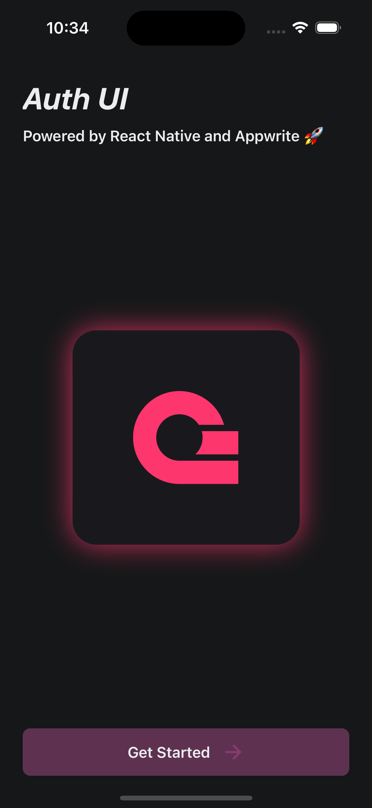
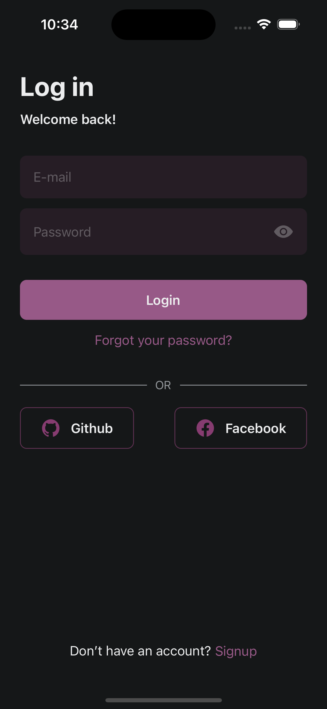
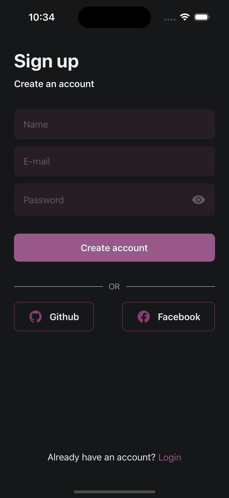
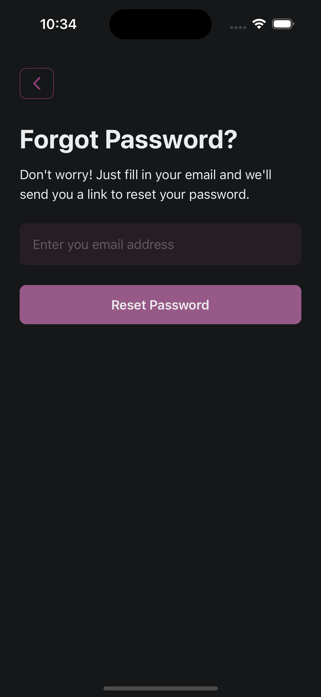
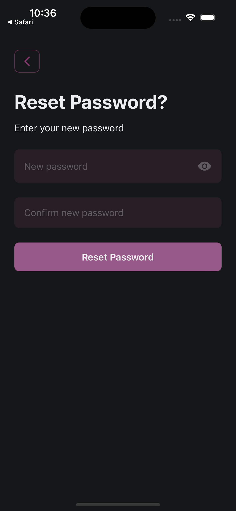
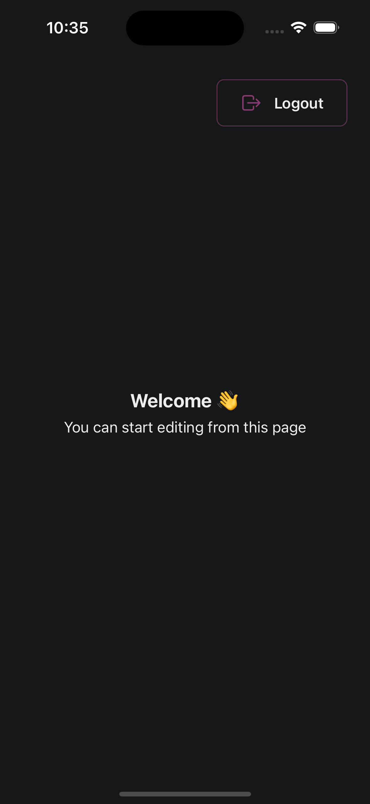

# React Native Auth UI

A beautiful auth template starter app built with React Native, Expo and Appwrite.

> Check out the blog here: [How I built an auth template powered by react native](https://bishwajeet-parhi.medium.com/i-built-an-auth-template-powered-by-react-native-and-appwrite-4a0b7ee90ba6)

## What is Appwrite

Appwrite is an open-source backend server that helps you build modern apps faster. It is a secure end-to-end backend server that is specially designed for frontend and mobile developers. It is a self-hosted solution that provides developers with a set of easy-to-use APIs to build any kind of project.

Learn more about Appwrite [here](https://appwrite.io/).

## Features

- Supports Email sign-in and sign-up
- Supports for OAuth providers
- Forgot password and reset password
- Beautiful and animated UI
- Built on File-based routing
- Supports Dark and Light mode

## Tech Stack

- [React Native](https://reactnative.dev/)
- [Expo](https://expo.dev/)
- [Appwrite](https://appwrite.io/)
- [Expo Router](https://github.com/expo/router)

## Getting started

If you are new to Github and haven't heard how to use this template, I recommend refer to [getting-started](docs/getting-started.md) guide on how to use this template.

Once you have the project setup, let's setup Appwrite Project and configure the app.

### Appwrite Setup

1. Create an account on [Appwrite](https://cloud.appwrite.io/) if you don't have already.

2. If you don't have and org setup, create a new organization.

3. Once thats done, create a new project. Give it a name and a custom project Id.

4. Add a new ios and android platform to the project. You can find the bundle identifier in the `app.json` file.

5. To Setup OAuth providers, go to the `Auth => Settings` tab in the Appwrite dashboard and add the providers you want to use. Refer to their individual docs on how to setup the OAuth providers.

#### Setup Cloud Function

This projects uses a cloud function that redirects back to your app when you click the password reset login you receive in your email. To setup the cloud function, I recommend using `Deploy from Git` option in `Functions` tab in the Appwrite dashboard.

To learn more about how to deploy a function from git, refer to the [Function docs](https://appwrite.io/docs/products/functions/deploy-from-git).

Else you can also use appwrite CLI to deploy the function.

Once you have setup the cloud function, add the following environment variable to the function.

```env
APP_SCHEME=your_app_scheme
```

For example,

```env
APP_SCHEME=rnauth
```

> [!IMPORTANT]
> For security reasons, it is recommended to add the `APP_SCHEME` in the function environment variable.
> This scheme is needed to redirect back to the app. You can find the scheme in the `app.json` file.
> Without this it won't redirect back to your app

- Once that's done, go to the `Domains` tab and copy the url of the function.
- Then add a new Web app Platform in the Appwrite Project
- Give any name of your choice and paste the hostname of the function in the Hostname field.

That's it for the Appwrite setup. Now let's configure the app.

### App Configuration

1. Copy the `.env.example` file to `.env` and fill in the details.

   ```bash
   cp .env.example .env
   ```

2. Fill in the Appwrite details in the `.env` file.

   ```env
   EXPO_PUBLIC_API_URL=your_appwrite_api_url
   EXPO_PUBLIC_PROJECT_ID=your_appwrite_project_id
   EXPO_PUBLIC_PLATFORM=your_app_bundle_id
   EXPO_PUBLIC_REDIRECT_URL=your_appwrite_redirect_url
   ```

> You will find the Redirect URL in your cloud function under the `Domain` tab. Paste the URL in the `EXPO_PUBLIC_REDIRECT_URL` field.

3. Ensure you change the app name , app slug and bundle identifier in the `app.json` file.

> [!NOTE]
> Ensure the bundle identifier is the same as the one you added in the Appwrite project.

4. (Optional) you can change the app splash screen and icon in the `app.json` file.

### Running the app

1. Install dependencies

   ```bash
   npm install
   ```

2. Prebuild the app

   ```bash
   npx expo prebuild
   ```

3. If you are development mode, ensure you type `npm run ios` or `npm run android` to start the app.

4. If the app is already installed, `npm run start` should be fine for you

## Screenshots

|        |           |
| :------------------------------------------------------------: | :-------------------------------------------------------------: |
|         |  |
|  |            |

## Contributing

Contributions are highly Welcomed 💙 . Feel free to open PRs for small issues such as typos. For large issues or features, please open an issue and wait for it to be assigned to you.

## Join the community

Join Appwrite community of developers and contributors to get help, share your projects and contribute to the platform.

- [Appwrite on GitHub](https://github.com/appwrite/appwrite): View appwrite open source platform and contribute.
- [Discord community](https://appwrite.io/discord): Geek out with other Appwriters and get help from the community.

## License

This project is open source and available under the [MIT License](LICENSE).
